# 🤖 Agentic AI Data Analyst

A production-ready **Multi-Agent AI System** that uses **LangGraph** and **LangChain** to perform intelligent data analysis through natural language. The system features specialized AI agents that collaborate to clean data, perform statistical analysis, create visualizations, and answer questions about your datasets.

## 🌟 Key Features

- **🎯 Multi-Agent Architecture**: Supervisor pattern with 5 specialized agents
- **🧠 Intelligent Routing**: Automatically routes queries to the most appropriate agent
- **📊 Comprehensive Analysis**: Data cleaning, statistics, visualizations, and insights
- **💬 Natural Language Interface**: Ask questions in plain English
- **🔍 Transparent Reasoning**: See which agents are working and their decision process
- **⚡ Powered by Google Gemini**: Using Gemini 1.5 Pro for supervision and Flash for specialized tasks

## 🏗️ Architecture

The system uses a **Supervisor Multi-Agent Pattern** built with LangGraph:

```mermaid
graph TD
    A[User Query] --> B[🎯 Supervisor Agent]
    B -->|Clean Data| C[🧹 Data Cleaner]
    B -->|Statistics| D[📊 Stats Analyst]
    B -->|Visualize| E[📈 Visualizer]
    B -->|General Q| F[💬 Query Answerer]
    C --> G[Response]
    D --> G
    E --> G
    F --> G
    
    style B fill:#667eea,color:#fff
    style C fill:#48bb78,color:#fff
    style D fill:#ed8936,color:#fff
    style E fill:#9f7aea,color:#fff
    style F fill:#4299e1,color:#fff
```



### 🤖 Agent Capabilities

| Agent | Icon | Expertise | Example Queries |
|-------|------|-----------|-----------------|
| **Supervisor** | 🎯 | Routes queries to appropriate agents | *(Automatic)* |
| **Data Cleaner** | 🧹 | Missing values, duplicates, outliers, data types | "Remove rows with missing values", "Handle outliers in the price column" |
| **Stats Analyst** | 📊 | Correlations, hypothesis testing, distributions | "What's the correlation between age and income?", "Test if sales differ by region" |
| **Visualizer** | 📈 | Charts, plots, heatmaps | "Create a bar chart of sales by category", "Show a correlation heatmap" |
| **Query Answerer** | 💬 | General questions, insights, summaries | "What are the top 5 products?", "Summarize the dataset" |

## 🛠️ Tech Stack

- **LangGraph**: Multi-agent orchestration and workflow management
- **LangChain**: Agent framework and tool integration
- **LangChain Experimental**: Pandas dataframe agents
- **Google Gemini**: LLM for reasoning and analysis (1.5 Pro & Flash)
- **Streamlit**: Interactive web interface
- **Pandas**: Data manipulation
- **Matplotlib & Seaborn**: Visualizations
- **uv**: Lightning-fast dependency management

## ⚙️ Setup

### 1. Install uv (if not already installed)
```bash
pip install uv
```

### 2. Clone and Install Dependencies
```bash
cd data-analysis
uv sync
```

### 3. Configure Environment Variables
Create a `.env` file in the project root:
```env
GOOGLE_API_KEY=your_gemini_api_key_here

# Optional: Enable LangSmith for debugging
LANGSMITH_API_KEY=your_langsmith_key
```

## 🚀 Running the App

Start the Streamlit application:
```bash
uv run streamlit run frontend/streamlit_app.py
```

The app will open at `http://localhost:8501`

## 📖 Usage Examples

### Data Cleaning
```
"Remove all rows with missing values in the sales column"
"Fill missing values in the age column with the median"
"Remove duplicate rows from the dataset"
```

### Statistical Analysis
```
"What's the correlation between price and quantity?"
"Show me descriptive statistics for all numeric columns"
"Is there a significant difference in sales between regions?"
```

### Visualizations
```
"Create a bar chart showing sales by category"
"Plot a scatter plot of price vs quantity"
"Show a correlation heatmap for all numeric columns"
```

### General Questions
```
"What are the top 10 products by revenue?"
"How many rows and columns are in this dataset?"
"Summarize the key insights from this data"
```

## 📂 Project Structure

```
data-analysis/
├── frontend/
│   └── streamlit_app.py          # Streamlit UI with agent display
├── src/
│   ├── data_analysis/
│   │   ├── agents/                # Specialized agents
│   │   │   ├── supervisor.py      # Routes queries
│   │   │   ├── data_cleaner.py    # Data cleaning
│   │   │   ├── stats_analyst.py   # Statistical analysis
│   │   │   ├── visualizer.py      # Chart creation
│   │   │   └── query_answerer.py  # General Q&A
│   │   ├── graph/                 # LangGraph workflow
│   │   │   ├── state.py           # State schema
│   │   │   └── workflow.py        # Multi-agent orchestration
│   │   ├── tools/                 # Custom LangChain tools
│   │   ├── memory/                # Conversation persistence
│   │   └── config.py              # Configuration
│   └── utils/
│       └── plot_utils.py          # Plotting utilities
├── pyproject.toml                 # Dependencies
├── Makefile                       # Build commands
└── README.md
```

## 🎯 How It Works

1. **User uploads a dataset** (CSV or Excel)
2. **User asks a question** in natural language
3. **Supervisor Agent** analyzes the query and routes to the appropriate specialist
4. **Specialist Agent** executes the task using pandas, scipy, matplotlib, etc.
5. **Results are displayed** with agent reasoning and visualizations
6. **Conversation continues** with context maintained across queries

## 🔧 Configuration

Edit `src/data_analysis/config.py` to customize:
- Model selection (Gemini Pro vs Flash)
- Temperature settings
- Token limits
- LangSmith integration

## 🧪 Testing

Run tests (when implemented):
```bash
uv run pytest tests/ -v
```

## 📊 Example Workflow

```
User: "Show me the first 5 rows"
→ Supervisor routes to Query Answerer
→ Query Answerer displays the data

User: "Clean this data by removing duplicates"
→ Supervisor routes to Data Cleaner
→ Data Cleaner removes duplicates and reports results

User: "Now create a bar chart of sales by region"
→ Supervisor routes to Visualizer
→ Visualizer creates and displays the chart
```

## 🤝 Contributing

Contributions are welcome! Areas for improvement:
- Additional specialized agents (e.g., ML model trainer, report generator)
- Custom tools for specific data operations
- Conversation memory and checkpointing
- Advanced visualization options

## 📝 License

MIT License

## 🙏 Acknowledgments

Built with:
- [LangGraph](https://github.com/langchain-ai/langgraph) by LangChain
- [Google Gemini](https://ai.google.dev/) for LLM capabilities
- [Streamlit](https://streamlit.io/) for the UI framework
